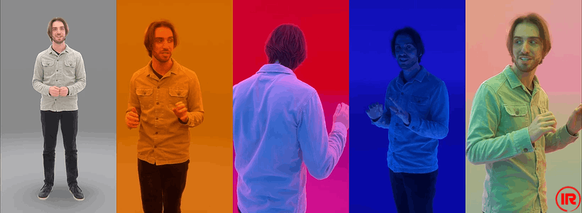

# Infinite-Realities Datasets: Michael Radiance Fields

<p align="center">
  
</p>

*Renders from the real-time **IR-Spatial-Humans** Desktop/VR demo showcasing the captures as a flipbook sequence of 3D Gaussian Splats*

| [Infinite-Realities Datasets Repository](https://github.com/Infinite-Realities-Research/IR-Datasets) | [Infinite-Realities Datasets Project Page](https://infinite-realities-research.github.io/IR-Datasets/) | [Website](https://www.ir-ltd.net/) | [YouTube](https://www.youtube.com/@infiniterealities4D) | 

## Description
Infinite-Realities presents a 30-second long 60fps recording of a presentation delivered by Michael Rubloff from [radiancefields.com](https://radiancefields.com/) captured in the [AeonX: DƐUS motion scanning system](https://www.ir-ltd.net/ir/deus/).

The setup for this capture comprised of 176 [ximea](https://www.ximea.com/) 12 MP machine vision cameras and 484 [Ida-Tronic](https://ida-tronic.com/) Photon LED lights with RGB (red, green, and blue) filters.

The lighting was programmed to change every 6 seconds (360 frames) going through the following states: GI (global illumination), Blade Runner 2049 Orange, Neon Red, Enchanting Aqua, and RGB Normals.

https://github.com/user-attachments/assets/34f6d3ab-af5c-41b7-9201-85eaffc027cf

## Dataset Details
This dataset contains the following:

- 1800 frames pre-registered as COLMAP Pinhole model format with undistorted images
- 1800 Gaussian Splat .ply frames trained as individual frames, cleaned with the background and floor removed
- Synchronized Audio .wav file

To request access to the Infinite-Realities Datasets, please read the license agreement and complete [this form](https://docs.google.com/forms/d/e/1FAIpQLScxM9nBuaO5MZf7Gk1IY7hCowU4Kd-yREfCN5JNxlZPiqgOOA/viewform?usp=header).

## IR-Spatial-Humans Desktop/VR Demo

| [Watch the full demo](https://drive.google.com/file/d/1vscPcDT4cFbyNfpSVCo09a42D8VKjKX8/view) | [Download the demo](https://drive.google.com/file/d/19RS0okfCDpjZLS4ixOk-SQrs2L3xi9-z/view?usp=sharing) |

The **IR-Spatial-Humans** demo can be run in Desktop mode or VR mode from the same app. For VR, it's recommended to use the Meta Quest Link app and a Quest 3; the demo cannot be run standalone on the headset. Please read the included readme for more information.

*This Desktop/VR demo contains an early version of the trained .ply files. The new dataset release was trained with images from an updated image pipeline and newer training method.*

## Citation

If you use our datasets in your research, please cite the main [Infinite-Realities Datasets](https://github.com/Infinite-Realities-Research/IR-Datasets) and the specific sub-dataset name below:

```bibtex
@misc{ir2025michaelradiancefields,
    author = {Infinite-Realities and Perry-Smith, Lee and Pearce, Henry and Rubloff, Michael},
    title = {Infinite-Realities Datasets: Michael Radiance Fields},
    year = {2025},
    publisher = {Infinite-Realities},
    note = {Part of the Infinite-Realities datasets repository},
    howpublished = {\url{https://github.com/Infinite-Realities-Research/IR-MichaelRadianceFields}}
}
```
